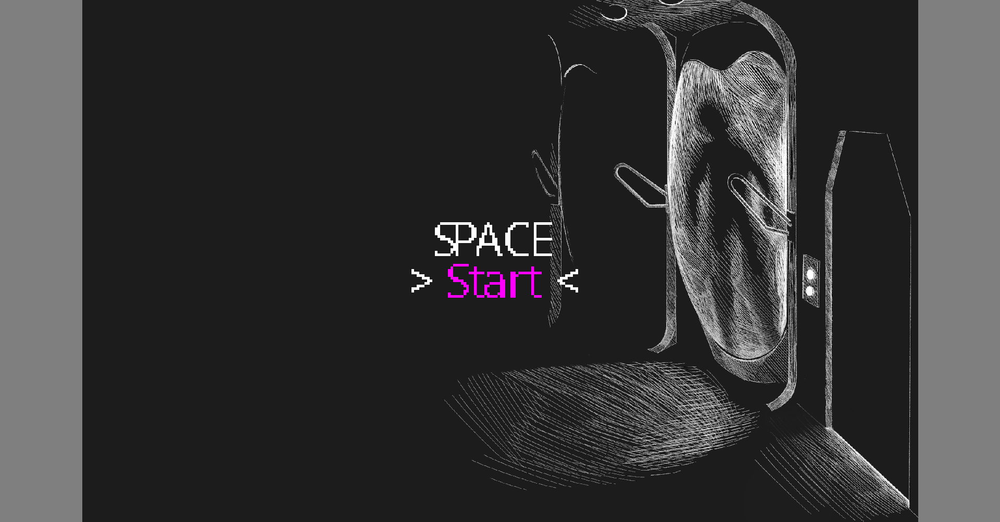

# SPACE - an adventure game

Authors: 

- Art: Yixin He 
- Programming: Jiechen Li and Malek Anabtawi 
- Writing: Malek Anabtawi 
- Sound: Internet 

Screen Shot:

How To Play:

	- Use left click to examine items, and right click to use them. 
	- You can open your inventory with the mousewheel, or the "i" key. 
	- Use [PageUp] and [PageDown] or scroll with the mousewheel to navigate through your inventory. 
	- Clean on an item in your inventory to try and use it with something else.

Sources for sound effects:

- Alarm Slow A1: https://www.fesliyanstudios.com/sound-effects-search.php?q=Alarm 
- Cryo-door: https://freesound.org/people/nooly/sounds/331357/
- Ambience: https://freesound.org/people/k2tr/sounds/322970/
- Spaceship crash: http://soundbible.com/1339-Sonic-Boom.html
- Another door: https://freesound.org/people/davilca/sounds/158458/
- Finger cutting: https://freesound.org/people/simonjeffery13/sounds/349847/
- Crowbar hitting glass: https://www.actionvfx.com/collections/free-bullet-hits-sound-fx
- Toolbox being opened: https://freesound.org/people/Talitha5/sounds/262538/
- Space tape: https://freesound.org/people/dersuperanton/sounds/434470/
- Engine failure and launch: https://www.soundfishing.eu/sound/spaceship
- Screen breaking: https://freesound.org/people/urupin/sounds/414047/

Ending wallpaper: https://wallpaperplay.com/walls/full/e/d/f/219506.jpg

If I missed anything, please let me know. 

This game was built with [NEST](NEST.md).

